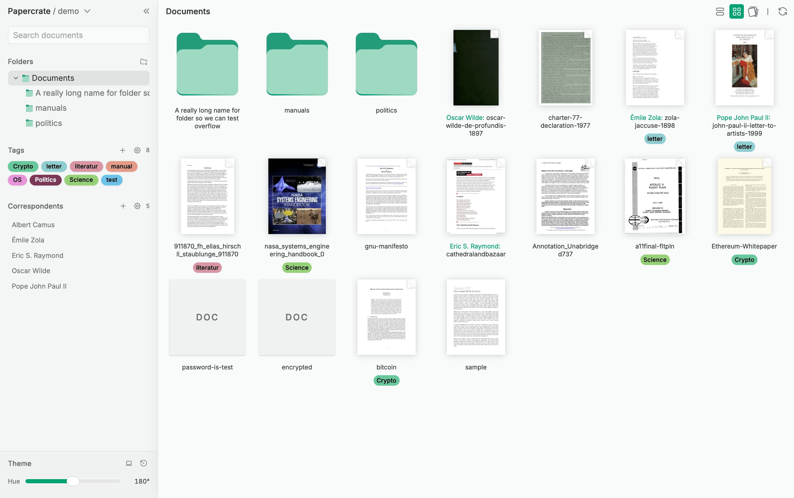
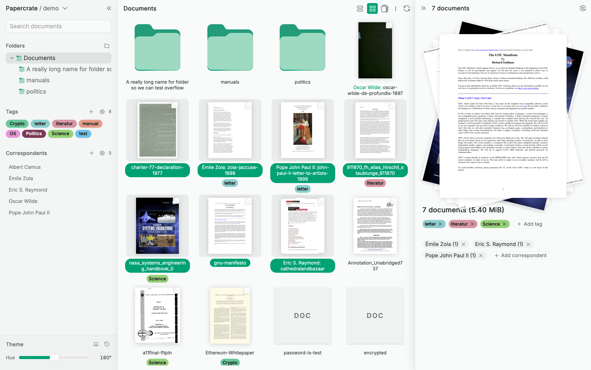
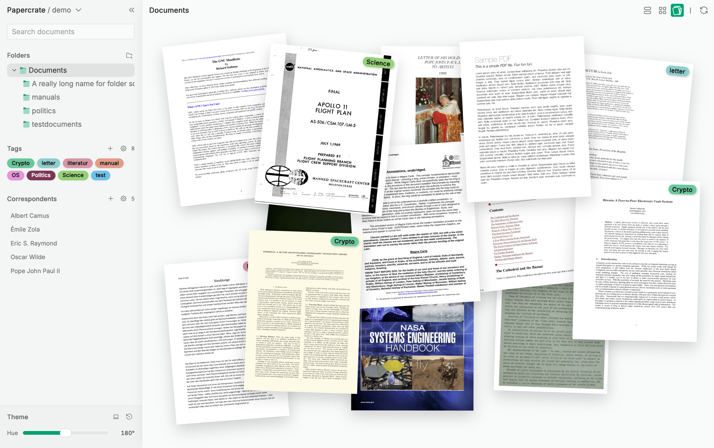
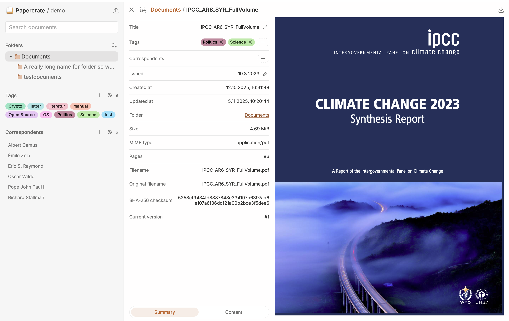

# Papercrate



Papercrate is a modern, open-source document management system (DMS) designed for organizing scanned documents and digital archives. It combines a fast, searchable backend with a sleek, drag-and-drop web interface.

### Features

*   **Document Management**: Organize files with folders, tags, and correspondents.
*   **OCR & Search**: Automatically extracts text from images and PDFs (via `ocrmypdf`) for full-text search (powered by Quickwit).
*   **Multi-Tenancy**: Built from the ground up to support multiple isolated tenants and users on a single instance, enforced via Postgres **Row-Level Security (RLS)** (Pro/Dev mode only).
*   **Modern Security**: exclusively uses **Passkeys (WebAuthn)** for secure, passwordless authentication.
*   **Storage Agnostic**: Stores files in any S3-compatible object store (MinIO, AWS S3, etc.).
*   **WebDAV Support**: Access your documents directly via the filesystem using the WebDAV protocol.

## Quick Start

The default `docker-compose.yml` uses pre-built images and runs with **Row-Level Security (RLS) disabled** (superuser access). Multi-tenancy is fully functional but enforced only at the application level.

1.  Review or create `.env` (the compose file expects `POSTGRES_PASSWORD`, `JWT_SECRET`, `MINIO_ROOT_PASSWORD`, etc.).
2.  Start the stack:

    ```bash
    docker compose up -d
    ```

3.  Create a demo user and tenant:

    ```bash
    # Create user 'demo' and tenant 'demo'
    docker compose exec backend /usr/local/bin/papercrate-admin create-user demo
    docker compose exec backend /usr/local/bin/papercrate-admin create-tenant demo

    # Add user to tenant (replace <TENANT_ID> from output)
    docker compose exec backend /usr/local/bin/papercrate-admin add-user-to-tenant demo <TENANT_ID>

    # Generate a magic link for initial login
    docker compose exec backend /usr/local/bin/papercrate-admin magic-token demo
    ```

4.  Visit `http://localhost:8080` (or your configured host) and log in.

## Building from Source

To build the images locally (for development or custom modifications), use `docker-compose.build.yml`:

```bash
# Create .env as usual
docker compose -f docker-compose.build.yml build
docker compose -f docker-compose.build.yml up -d
```

## Authentication

**Papercrate does not support password-based login.** Authentication is handled exclusively via:

1.  **Passkeys (WebAuthn)**: The primary login method. This requires the application to be served over **HTTPS** (or `localhost`) due to browser security restrictions.
2.  **Magic Tokens**: Used for initial account bootstrapping or recovery (via the admin CLI).

> [!IMPORTANT]
> The `WEBAUTHN_ORIGIN` environment variable must exactly match the URL in the browser (including scheme and port), or passkey registration and login will fail.

## Configuration

*   **Secrets**: The stack expects `POSTGRES_PASSWORD`, `JWT_SECRET`, `MINIO_ROOT_PASSWORD` in `.env`.
*   **WebAuthn**: `WEBAUTHN_RP_ID` (e.g. `papercrate.local` or `localhost`) and `WEBAUTHN_ORIGIN` (scheme + host + port) must be set.
    *   Papercrate does not terminate TLS itself. For non-localhost access, front it with a reverse proxy (Caddy, Traefik, Nginx) handling HTTPS.
    *   Set `PROXY_DOWNLOADS=true` to keep MinIO private.
*   **WebDAV**: Exposed on port `3001`. Create a token with `webdav` capability in the UI and use it as the password.

## Admin CLI

The `papercrate-admin` tool drives tenant management. Run it inside the backend container:

```bash
docker compose exec backend /usr/local/bin/papercrate-admin <command>
```

Common commands:
*   `create-user <username>`
*   `create-tenant <name>`
*   `add-user-to-tenant <username> <tenant_id>`
*   `magic-token <username>` — Generate a temporary login link
*   `users list` — List all users
*   `tenants list` — List all tenants

## Kubernetes Deployment (Helm)

For larger deployments, a Helm chart is provided in `k8s/papercrate`.

1.  Customize `k8s/papercrate/values.yaml` (especially persistence, ingress, and secrets).
2.  Install the chart:

    ```bash
    helm install papercrate ./k8s/papercrate --namespace papercrate --create-namespace
    ```

The chart includes a pre-install/upgrade hook to run database migrations automatically.

## Screenshots





---

For development workflows (local stack, integration tests, migrations, and
configuration details) see [DEVELOPMENT.md](./DEVELOPMENT.md).
